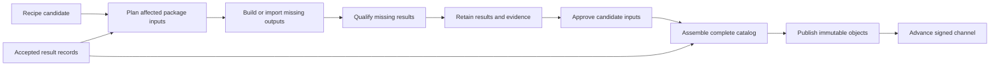

# Packaging architecture evaluation

Implementation branch: `refactor/package-ci`. Rootbeer owns its package system;
GitHub Actions remains the orchestration platform. Work proceeds in reviewable
phases; package definitions and the existing build executor are preserved.

## Phase status

Phase 1 is implemented: archive the unmerged GitHub-specific CI draft and add
`rootbeer-forge --catalog packages verify-bundle bundle`. This exposes the existing
publication validation as a local operation, including expected-catalog matching.
The index's run-selection and promotion helpers remain the active integration.

Validation: packaging and Forge tests pass (54 tests), including catalog mismatch,
coverage, and missing/corrupt/symlinked content; targeted all-target Clippy passes.

Phases 2–5 are planned below. Switching index workflows requires a published
engine revision with the new operation; that pin update is a later integration
step. The index checkout's existing workflow deduplication is left intact.

## Recommendation

Keep the existing client/build separation and package definitions. Use GitHub Actions for orchestration and replace publication's inference from Git history with explicit, durable package verification records. Keep GitHub-specific policy in index workflows and small helpers; keep package semantics in Forge. Do not adopt the staged `rootbeer-forge ci` interface as the architectural direction.

Rootbeer's own recipe, build, store, and distribution tooling fits that product scope. The design question is where reusable package behavior ends and the official index's operational policy begins. Adopting another package ecosystem is outside this redesign.

Self-hostability is a boundary test: package operations and their results should remain usable outside Actions. The implementation target is GitHub Actions. Use its scheduling, matrices, job dependencies, retries, concurrency controls, environments, and reporting directly. A second deployment mode or a generic orchestration framework is outside the current scope.

This resembles the separation between Nix's build machinery and Hydra's continuous integration service. Hydra defines projects/jobsets over Nix inputs and tracks their evaluations and builds. The analogy informs responsibility boundaries; it does not require copying Hydra's service architecture or feature set. [Hydra documentation](https://github.com/NixOS/hydra).

## Constraints

- Preserve existing Lua package definitions and their behavior. Recipe or schema changes are a last resort, justified by a demonstrated package-model limitation that tooling cannot reasonably address. Identify affected definitions and propose compatibility/migration before making such a change.
- Derive verification identities and records from the existing expanded catalog, build plans, receipts, and environment information. Generated result metadata is a separate contract, not new fields maintainers must add to recipes.
- Preserve and extend the improving build system. Focus this redesign on coordination, persistence, result reuse, trust, and publication; backend changes should address concrete gaps only.
- Package compatibility decisions must not require GitHub run IDs, workflow names, or merge conventions. Official automation may use those facts to establish producer trust and select approved candidates.
- Keep package operations callable locally with the same definitions and explicit inputs. Different environments may legitimately produce different build identities; a CI job name or run ID must not be a package input.
- Do not build a coordinator service, worker protocol, scheduler, or provider abstraction for hypothetical deployments. Add interfaces when a concrete use requires them.

## Scope and evidence

Reviewed the Rootbeer checkout at `acdc3c8`, its staged changes, the neighboring index checkout at `265214b`, its staged workflow changes, build/export/cache/publication code, installer distribution workflows, and a sample of live GitHub Actions runs and caches. Local staged changes and live workflows are different states; observations below distinguish them. This is an architecture review, not qualification of every production recipe or a complete security audit.

The local index has 132 recipe files and targets Linux x86-64, Linux ARM64, and macOS ARM64. No CI jobs, builds, merges, or publications were triggered for this review.

Live evidence:

- [Post-merge publication 35280463600](https://github.com/tale/rootbeer-index/actions/runs/35280463600) reused a PR bundle: `verify` was skipped. Publication took about 5m15s, including 1m48s setting up the engine and 2m47s uploading/checking blobs. Reuse is not universally broken.
- [Discovery 35405428073](https://github.com/tale/rootbeer-index/actions/runs/35405428073) completed in about ten minutes. Logs show reused builds of Git, curl, OpenSSL, and other dependencies, followed by package checks and a new Rootbeer build. This is evidence of compilation reuse, not a full qualification cache hit.
- The cache API reported 20 entries totaling 10,270,041,160 bytes. Successive runs stored separate whole-directory result caches, roughly 0.60–0.84 GB each in the sampled listing. This establishes duplication; it does not prove a particular cache eviction caused a rebuild.

## What is already sound

- `rootbeer-core` depends on package/store functionality, not build/packaging crates. The configuration runtime is not currently linked to the CI implementation.
- Recipes live in the index repository. Backends produce phases for a shared executor. These boundaries are useful.
- Dependency outputs participate in build keys; the executor shares completed dependency builds within an invocation. Independent work can continue after failures.
- Archives and receipts are hashed. Assembly checks coverage and file integrity. Export checks installation and offline lock replay.
- Package compilation has no publication credentials. The publisher validates bundles and does not execute package binaries.
- GHCR archive storage and the signed catalog are independent of the documentation deployment. Existing locks can retain immutable references.

Preserve these properties throughout the redesign.

## Problems, in priority order

### 1. Verification has no durable identity independent of a workflow run

The existing Ruby selector and proposed Rust selector compare entire recipe trees, engine pins, actions, and workflow definitions; search up to 20 first-parent commits; find associated merged PRs; then locate an unexpired artifact by name. That is a substantial reconstruction of facts the verifier could have emitted directly.

Full-tree equality is conservative and can safely promote a complete bundle, but it cannot combine independently verified package results from different catalog revisions. An unrelated recipe change, workflow edit, missing PR association, or expired artifact can defeat that path.

The architectural replacement is a verified result for each package/version/platform/input closure, plus an explicit reference to the candidate's result manifest. GitHub run IDs remain provenance and lookup metadata; they stop being the package identity.

### 2. Build reuse and qualification reuse are inconsistent

[`export.rs`](../crates/rootbeer-packaging/src/export.rs) only uses the complete export cache when `recipe.build.is_none()` and isolation is disabled. Source packages reuse compiled archives through `BuildCache`, but revisit build-plan realization, checks, packaging, and offline export verification.

[`lib.rs`](../crates/rootbeer-build/src/lib.rs) runs recipe checks even on a build-cache hit. Export also runs checks against the published installation. These are potentially useful separate checks, but there is no reusable evidence object distinguishing their successful outcomes.

Source receipts also depend on the current catalog: the build cache restore path rewrites `artifact.catalog_sha256`, and [`bundle.rs`](../crates/rootbeer-packaging/src/bundle.rs) requires a matching whole-catalog hash. Binary export caching preserves old receipts. This makes the two paths behave differently when unrelated catalog metadata changes.

Separate immutable build evidence, qualification evidence, and catalog membership. Reusing an archive must not require rewriting what its original build claimed to have seen.

### 3. Actions cache is being used as durable package-result storage

`prepare-package-results` restores `.package-results`, then saves another snapshot keyed by run ID and attempt. This duplicates shared archives and gives concurrent runs separate cache snapshots rather than an accumulating collection of results.

PR bundles default to two-day retention; discovery bundles use fourteen days. A delayed merge can lose the easiest promotion route. PR caches are also scoped differently from main caches, so cache restore is not a dependable PR-to-main handoff. See [GitHub cache restrictions](https://docs.github.com/en/actions/reference/workflows-and-actions/dependency-caching).

Use Actions cache for disposable downloads/compiler intermediates. Store accepted archives and result records durably by digest. Expiring a transport artifact must not erase accepted verification evidence.

### 4. Engine invalidation is broader than the behavior that changed

[`scripts/cache_inputs.rs`](../scripts/cache_inputs.rs) hashes complete crate source trees, including tests, plus the workspace manifest and lockfile. The build identity includes all store/package/build sources; the binary export identity additionally includes all packaging sources. A Rust backend edit can invalidate unrelated builds; adding `ci.rs` changes the binary export identity despite not changing package qualification behavior.

There is already an improvement over hashing the entire repository: CLI source changes alone are excluded. However, unrelated dependency-lock changes and source files inside included crates still widen invalidation.

Split identities by relevant executor, backend, normalization, and qualification behavior. Use conservative dependency mappings, including relevant Rust dependencies and build configuration. Shared executor changes may legitimately affect every source package. Do not replace broad hashes with a manually asserted promise that an arbitrary change is harmless.

### 5. The staged CI port crosses the wrong boundary

The initial unmerged `ci.rs` draft knows GitHub REST endpoints, workflow filenames, artifact names, merge ancestry, commit trailers, bot identity, and how to push to `main`. Its Forge command also reads GitHub environment variables and writes `GITHUB_OUTPUT`.

Those are index automation policies. They do not belong in a general package library. Moving them into Rust adds an engine release/pin dependency to changing CI policy, while retaining the original state machine.

There is also a concrete port regression: the downloader constructs `https://api.github.com/artifacts/{id}/zip`; GitHub documents `repos/{owner}/{repo}/actions/artifacts/{artifact_id}/zip`. The current Ruby implementation uses the repository-qualified endpoint. Mocked policy tests do not cover that production adapter. See [GitHub's artifact API](https://docs.github.com/en/rest/actions/artifacts#download-an-artifact).

Retain the useful staged change that makes discovery call the reusable package workflow. Treat increased timeouts as operational settings, not a redesign. Preserve the original CI draft outside the implementation before replacing it.

### 6. Rootbeer has three overlapping binary paths

[`build.yml`](../.github/workflows/build.yml) builds/tests Rootbeer; [`deploy.yml`](../.github/workflows/deploy.yml) separately builds nightlies and deploys documentation; index discovery independently selects a CI-green source commit and builds it through `packages/rootbeer.lua`.

The website workflow starts on push without depending on CI success. Its release build has different environment values and runner selection, including cross-compilation for Linux ARM64. Thus CI success does not establish that the downloadable nightly bytes were tested. These outputs cannot simply be declared interchangeable today.

Produce one canonical release candidate per revision, target, features, and release configuration; test it; then distribute those bytes to the intended channels. Preserve the index's source-build policy through a shared build contract/receipt, rather than quietly converting the Rootbeer recipe to an upstream-binary exception. Publish Forge tooling separately from the version of Rootbeer being packaged: the bootstrap engine pin and package version are different identities.

### 7. Isolation exists but the index workflow does not select it

The build library supports pinned environments and OS isolation. The index's `export-packages` action supplies neither `--isolate` nor an environment lock. A runner image label and version digest identify an environment; they do not make it hermetic or sandbox source code.

Keep that distinction explicit. Build/qualification jobs must remain credential-free, and their data must enter a fresh, trusted publication job. An archive checksum proves byte integrity; it does not prove an approved workflow or recipe produced those bytes. Attestations help establish provenance, but do not establish that build code is safe or tests are sufficient.

### 8. Discovery, publication, and retention do more work than the update needs

Discovery has schedule, push, dispatch, and Rootbeer-specific paths; it uses a special source updater, candidate artifacts, and commit trailers. A failed candidate can block assembly of the full candidate catalog even though successful work survives in caches. Rootbeer update notifications also create a commit in the index, while a polling path already exists.

The publisher walks every referenced GHCR archive, invokes ORAS, and downloads it anonymously for hash verification on every publication. Content deduplication may avoid reuploading bytes, but the loop still processes the full catalog. Pages history and retained versions also grow over time.

Separate active qualification targets from retained installation artifacts. Old locks need their bytes and metadata kept, not automatic rebuilding of every historical version on every environment update. Define historical retention, active-version coverage, and scheduled rechecks independently. This is a policy change to approve explicitly.

## Proposed architecture: Rootbeer's package system with explicit boundaries

### Ownership

| Owner | Responsibilities |
| --- | --- |
| `rootbeer-core` / client | Configuration, resolution, locks, verified installation, profiles |
| `rootbeer-build` | Resolved build plans, backends, execution, local build cache |
| `rootbeer-packaging` / Forge | Recipe validation, qualification records, compatibility checks, assembly, catalog signing |
| `rootbeer-index` workflows and helpers | Official recipes, discovery, producer trust, candidate approval, retention, and publication policy |
| GitHub Actions | Triggers, platform jobs, dependencies between jobs, retries, concurrency, environments, and reporting |
| Existing infrastructure | GHCR/OCI transport, retained artifacts, provenance mechanisms, and Pages deployment |

Keep the current crate layout initially. A separate repository or more crates would not fix the semantic coupling. Split code only where an actual dependency boundary requires it.

### Boundary rules

Package semantics belong in Rootbeer: recipe expansion, dependency resolution, build identities, execution, installation checks, artifact integrity, coverage, and signed catalog formats. These are useful to any catalog maintainer and should have local APIs and CLI operations.

Index policy belongs in `rootbeer-index`: supported platforms, approved engine/verifier identities, update cadence, which candidates may enter the official catalog, required reviews, retention, and release channels. GitHub integration translates events and API responses into explicit inputs to those operations.

For example, Forge may determine whether a result matches a recipe and its dependency closure. The index decides whether it trusts the producer and approves publishing that recipe. Forge may assemble and sign an explicitly supplied catalog; the workflow owns credentials, Git commits, and channel deployment. Generic OCI transport or an upstream GitHub release resolver is legitimate tooling; hard-coded workflow names and merge policy are a different responsibility.

The implementation language is not the boundary. A small tested Rust, Python, or Ruby helper in the index can be appropriate where workflow expressions and existing actions are insufficient. Do not move package compatibility rules into shell scripts to remove `ci.rs`. Keep orchestration in Actions; there is no need to wrap its job lifecycle in a Rootbeer framework.

Use explicit data contracts between the layers:

| Operation | Inputs | Output |
| --- | --- | --- |
| Plan package work | Catalog, target/environment, policy identities, admitted existing results | Missing or invalidated work with reasons |
| Build and qualify | Resolved work and dependency artifacts | Immutable outputs, receipts, qualification records |
| Assemble catalog | Approved catalog and compatible admitted results | Complete validated snapshot |
| Publish | Validated snapshot, explicit destination and signing configuration | Immutable publication objects and channel manifest |
| Actions workflows/helpers | Event, repository policy, trusted producer metadata | Explicit invocations, candidate references, check reports, deployment |

Package operations must work without `GITHUB_*`, a particular branch name, or the official index repository. The official workflows enforce producer and approval policy around those operations. Local invocation demonstrates the boundary; building a second CI system is not an acceptance requirement.

### Use Actions directly

Keep the existing native platform matrix and reusable verification workflow. Jobs invoke Forge, upload results, and use ordinary job dependencies to assemble and publish. Actions owns job attempts and status. Forge owns whether a retained package result is compatible and which package work remains when a job is retried.

Persist successful package results independently of a job's success and temporary artifact lifetime. A retry can invoke the same export command and recover completed results. This needs durable package evidence, not a second database of workflow states, worker leases, or custom dispatch.

The existing build executor owns dependency ordering and bounded concurrency within each platform job. Avoid a CI job per package until measured scheduling or retry costs justify that change. Report reuse reasons through normal logs and job summaries.

### Data and flow

The smallest useful new contract is a versioned result manifest. It binds:

- Package/version/platform and resolved recipe inputs, including source/patch hashes and dependency closure.
- Build identity: relevant executor/backend semantics, toolchain/SDK/environment, target ABI, and dependency artifact identities.
- Archive and installed-tree hashes, exported files, and runtime dependency closure.
- Qualification identity: tested archive, checks, install/offline/audit policy, and qualification environment.
- Original receipts and producer provenance: source revision, engine binary digest, producer identity, evaluation and attempt. GitHub workflow/run identity is adapter-specific evidence, not a required field for every producer.

A build result and its qualification can have different lifetimes. A checks-only change should requalify an existing archive; an input change should rebuild it. Presentation-only catalog metadata should require neither. Changes to installation normalization may invalidate both.

Initially key dependent work conservatively to changed dependency inputs. Later, where safe, reuse consumers when rebuilt dependencies have identical output/contracts. Resolve downstream identities after changed dependencies finish; do not pretend their new digests are knowable before execution.

Forge should expose machine-readable planning, result validation, and assembly without reading GitHub environment variables. Extend the existing commands before inventing a command family for each workflow. The plan must explain every miss: missing result, changed input, incompatible environment, changed policy, revoked provenance, or explicit recheck.

### Storage and promotion

Use the existing GHCR/OCI infrastructure for archives and immutable result manifests. Keep concrete transport code separate from result validation; a storage-provider framework is unnecessary. Keep a small authenticated lookup manifest mapping input identities to result digests. Mutable tags may locate candidates; verified digests and approved provenance authorize reuse. OCI handles content transport, not package compatibility policy. [ORAS already supports these artifact operations](https://oras.land/docs/commands/use_oras_cli/).

Collect successful results even when another package or platform fails. Persist dependency results too. Use the existing three platform jobs and bounded in-process queue. Retrying a platform should immediately recover completed results.

PR verification emits an exact candidate manifest reference through its check/report. Discovery uses the same candidate contract. After merge, the publisher selects that explicit candidate and compares its resolved inputs with the approved catalog. A merge SHA can differ without requiring a rebuild. Concurrent recipe changes cause replanning of affected closures, then reassembly with accepted results.

Increase temporary artifact retention during migration, then retain admitted candidate results in OCI independently of Actions expiry. Candidate expiry and permanent published retention need separate policies. Missing evidence must produce a visible repair plan; it must not silently initiate a cold full-catalog build.

### Trust and transaction boundaries

Use a pinned trusted reusable verifier, independent of the candidate's editable workflow files. Candidate engine changes require explicit review and a newly accepted engine digest. Run source code without repository, registry, signing, or attestation-write credentials. If untrusted forks need maintainer admission, dispatch the trusted verifier against the exact admitted revision before qualification, rather than rebuilding after merge as the normal workflow.

A fresh collector job validates origin, source inputs, artifact digests, and qualification records, then stores inert candidate data. It never runs uploaded tools or package binaries. A candidate result is not automatically approved for publication or reuse by other trusted builds. Unapproved candidates stay outside the accepted-result lookup. Isolation and verifier trust must be established before treating source-build output as independently trustworthy evidence.

Use GitHub attestations with an explicit signer/workflow policy where available. Artifact hashes alone never establish producer trust. Keep the existing signed client manifest initially; producer provenance and the client's catalog signature answer different questions. Keep GitHub evidence separate from the portable package-input record, without implementing hypothetical producer adapters. Verify the repository's actual feature access and fork permissions during implementation. See [GitHub's reusable-workflow provenance guidance](https://docs.github.com/en/actions/how-tos/secure-your-work/use-artifact-attestations/increase-security-rating).

Publication validates complete coverage, uploads missing immutable objects, and advances the channel last. Preserve checks for anonymous availability and content integrity; reuse previously established publication evidence for unchanged digests and schedule independent availability audits. An upload-only failure must be resumable without building packages again.

Serialize channel advancement and derive its sequence from accepted channel state. Re-read the approved catalog/channel before the final update so a delayed retry cannot replace a newer publication with older package contents merely by having a larger run number. Record candidate-to-publication completion explicitly. Keep old signed snapshots and lock-referenced artifacts readable.

Independent discovery candidates can eventually publish in compatible groups, retaining the previous version of a failed candidate. Every resulting snapshot still needs complete coverage and a consistent dependency graph. Do not weaken assembly requirements just to make a batch green.

### Environments and Rootbeer releases

For Linux, evaluate pinned build images and an explicit libc/CPU baseline. For macOS, pin and record the SDK, toolchain, deployment target, and runner environment; retain native macOS verification. Test activation of the existing sandbox against representative recipes before enabling it catalog-wide. Keep broad environment invalidation while ambient dependencies remain possible.

Release automation should publish trusted Forge binaries once for each accepted engine revision/platform. CI can download and verify them instead of compiling the engine in discovery, verification, selection, and publication jobs. The publisher must never execute a Forge binary supplied by an untrusted candidate.

For `rb`, consolidate canonical release builds and native smoke checks, then promote the same archive to the installer and package catalog using a shared package contract. Decouple documentation deployment. Keep source recipe support without requiring every distribution channel to compile another copy. Retain old client schemas and endpoints during this infrastructure migration.

## Scope of external tooling

The initial evaluation considered delegating package ownership to Nix, Rattler, or providers. The clarified product direction rules out that migration as the answer to conflation. Their architectures can inform the design without replacing Rootbeer's package model.

Keep Rootbeer responsible for its semantics and use established tools for commodity infrastructure: compilers, OCI transport, job scheduling, and provenance mechanisms. Existing optional package providers remain separate product integrations. This redesign does not change the source-build policy or move production recipes out of the index.

## Tools to adopt selectively

- **GitHub Actions reusable workflows:** already available, appropriate for the three native platforms. Keep the staged deduplication.
- **ORAS and OCI:** already used; extend storage reuse before introducing another storage service or custom blob server.
- **GitHub artifact attestations:** use for verifiable producer identity; retain package-specific validation and approval policy.
- **cargo-dist:** evaluate for distributing `rb` and Forge themselves. It generates release workflows, archives, installers, and manifests. It does not replace the third-party package catalog. Its adoption still requires alignment with Rootbeer's existing installer and channel contract. [cargo-dist capabilities](https://axodotdev.github.io/cargo-dist/).
- **Renovate:** useful for regular dependency and tool pins. Its regex manager can extract custom version fields, but that does not replace per-platform asset discovery, checksum validation, or Rootbeer's recipe expansion. [Custom manager documentation](https://docs.renovatebot.com/modules/manager/regex/).
- **Dagger:** potentially useful for Linux build execution, but its documented execution model uses Linux containers, including on macOS. It would leave native Darwin qualification and distribution policy to solve. Do not add it solely to replace YAML. [Dagger execution model](https://docs.dagger.io/0.20.2/).

Use Actions as the orchestration platform. Preserve portability through explicit package inputs and result records. No daemon, remote scheduler, provider interface, or custom CI UI is proposed.

## Proposed implementation sequence

| Step | Concrete work | Exit condition |
| --- | --- | --- |
| 1. Establish boundaries | Archive the unmerged CI draft; expose local bundle verification with expected-catalog matching; document producer-trust responsibility; preserve existing index integration | Bundle validation is callable without GitHub or publication credentials and rejects mismatches, incomplete coverage, and corrupt local contents |
| 2. Make verification reusable | Add versioned per-package result records and planning output; separate original receipt, qualification, and catalog membership; support source results and persisted partial success | A checks-only change reuses the archive; an unrelated recipe change preserves original receipts |
| 3. Make reuse durable in Actions | Retain successful package records/archives in OCI; use explicit candidate references and the existing platform jobs | Actions retries recover completed work; artifact expiry or publication retry does not rebuild accepted results |
| 4. Narrow invalidation | Separate relevant engine/backend/qualification identities; pin environments; preserve conservative fallback | Rust-backend-only changes do not rebuild unaffected C packages; shared executor changes invalidate the documented scope |
| 5. Unify distribution | Gate downloadable candidates on checks; publish trusted Forge tooling once; share canonical `rb` release artifacts/contracts; separate website deployment; simplify update notifications | Installer and catalog identify the same tested release payload; publication has no engine compilation step |

Validate each phase before starting the next. Check local invocation without
GitHub environment variables throughout. Keep storage and provenance code
concrete; introduce abstractions only when a current requirement needs them.

For migration, import only historical results whose inputs and producer evidence can actually be established. Classify the rest as missing evidence and schedule only the affected work. Do not warm caches with a baseline build. Dual-read old and new result formats temporarily, shadow-check promotion decisions, then remove Git-history inference after the new path has passed the cases below. Retain rollback to the last accepted snapshot throughout.

## Acceptance cases

1. Add an independent package: only its declared platforms build/qualify; existing accepted results remain byte-identical.
2. Change one dependency: only its affected consumers need new decisions; independent packages do not rerun.
3. Change checks only: qualification reruns against the existing archive without compilation.
4. Change docs, a CI display name, or unrelated CLI code: no package rebuild; trust-policy changes remain explicitly evaluated.
5. Fail one package/platform: completed results survive and retries schedule only missing/invalidated work.
6. Merge after temporary artifacts expire: retained candidate records still promote exact verified bytes.
7. Merge two PRs against different bases: replan affected closures and assemble compatible results without requiring equal whole-catalog hashes.
8. Submit fabricated receipts, a wrong artifact digest, an unapproved workflow, or mismatched dependency outputs: reject admission/publication with a reason.
9. Fail midway through upload or Pages deployment: resume publication without source builds; the previous valid channel remains recoverable.
10. Retry an older publication after a newer one: prevent catalog rollback, even if the retry has a larger GitHub run ID.
11. Upgrade the engine: backend-specific changes have scoped impact; shared build behavior and environment changes invalidate all genuinely affected results.
12. Install an old lock and a new release offline from cached contents: keep client behavior and retained artifact references intact.
13. Invoke package validation/build/assembly locally with explicit inputs and unchanged definitions: no GitHub environment variables or official-index Git history are required.
14. Compare the production recipe definitions before and after the tooling migration: no migration edits are required. Any proposed exception identifies a concrete modeling limitation and a compatibility path before implementation.
15. Retry a failed Actions platform job: recover retained successful package results through the same export operation, without a custom workflow-state service.

Measure builds, qualification executions, bytes transferred, engine setup time, and reuse rejection reasons. A green run or a cache-hit percentage alone is not enough to demonstrate improvement.

## Phase 2 implementation slice

Prove the boundary with a small local catalog containing a source package and a dependency. Define a versioned qualification record using the existing build artifacts, retain the original receipt, and let assembly consume that record after unrelated catalog metadata changes. Change checks separately from build inputs and demonstrate that only qualification reruns. Use generic regression fixtures in Rootbeer; production recipes stay in `rootbeer-index`.

Have the existing index verification workflow emit and consume those records. Exercise a failed package followed by an Actions retry and show that successful results survive. Keep existing publication gates until the result-based selection establishes equivalent producer trust and catalog approval. Durable OCI retention and broader workflow migration follow that proof.

This slice fixes reusable qualification and artifact handoff while retaining the current recipe model, build executor, and Actions orchestration. It introduces no general-purpose CI framework.
